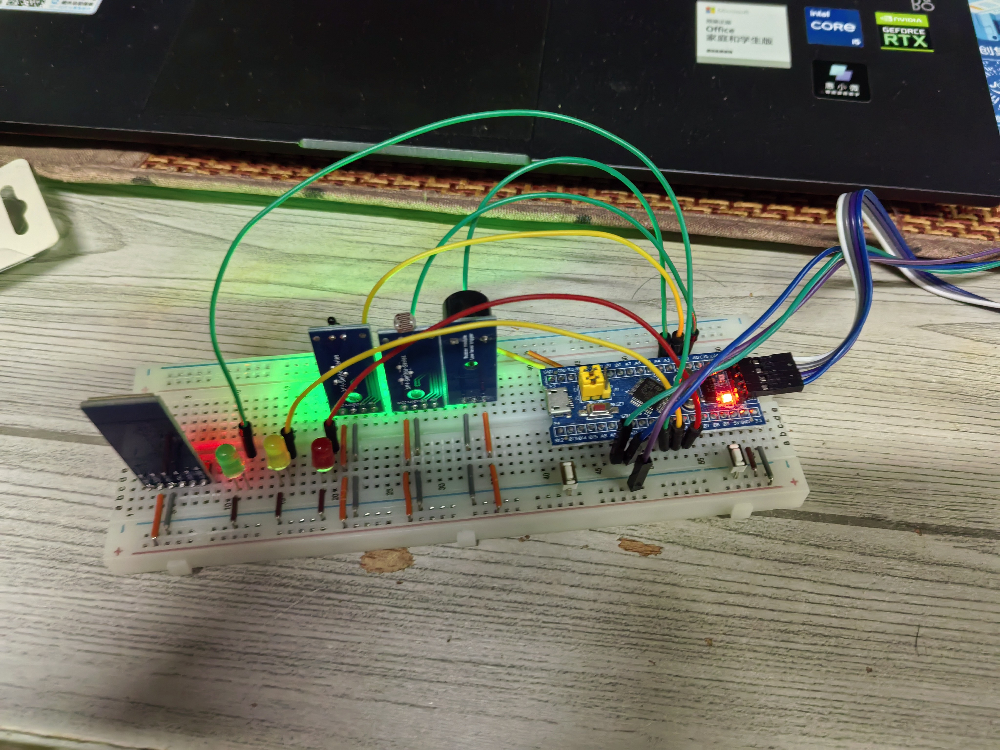
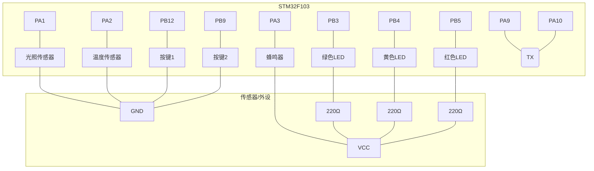

# STM32 智能环境监测报警系统

这是一个基于 `STM32F103C8T6` 的多功能环境监测报警系统。它能够通过 ADC 精准采集环境的光照强度和温度，并在数值超过预设阈值时，立即触发声光报警，同时通过串口实时上报数据。项目还包含了 PWM 呼吸灯和多模式按键控制，是一个功能完整、交互友好的嵌入式系统实践。

## 🎬 项目演示

### 项目实物图



### 功能演示视频


---

## ✨ 主要功能

- **🌡️ 双通道环境感知**：通过 **ADC+DMA** 技术，高效、实时地采集环境 **光照强度** 与 **温度** 数据。
- **🚨 智能分级报警**：
  - **光照超标**：黄色 LED 闪烁，蜂鸣器鸣叫，并通过串口发送高亮警报。
  - **温度过高**：红色 LED 闪烁，蜂鸣器以更高频率鸣叫，警示危险等级。
- **💡 PWM 呼吸灯**：在系统正常运行时，绿色 LED 呈现优雅的呼吸灯效果，提供清晰、美观的状态指示。
- **🖥️ 实时数据监控**：通过 **USART1** 串口，将采集到的环境数据实时发送到上位机，便于调试和数据记录。
- **🖲️ 双按键灵活控制**：
  - **按键 1**：控制系统的开关机状态。
  - **按键 2**：在不同工作模式之间进行切换。

---

## 🔌 硬件接线图

所有硬件与 STM32 的连接关系如下，请根据此图进行搭建。

| 模块/外设            | STM32 引脚 | 功能描述                         |
| -------------------- | ---------- | -------------------------------- |
| **光照传感器 (ADC)** | `PA1`      | ADC1_CH1，采集光照强度模拟信号   |
| **温度传感器 (ADC)** | `PA2`      | ADC1_CH2，采集温度模拟信号       |
| **蜂鸣器 (BEEP)**    | `PA3`      | 输出高低电平控制报警发声         |
| **绿色 LED (PWM)**   | `PB3`      | TIM2_CH2，PWM 输出控制呼吸灯效果 |
| **黄色 LED (告警)**  | `PB4`      | GPIO 输出，用于光照过强报警      |
| **红色 LED (告警)**  | `PB5`      | GPIO 输出，用于温度过高报警      |
| **按键 1 (开关机)**  | `PB12`     | 外部输入，检测用户操作           |
| **按键 2 (模式)**    | `PB9`      | 外部输入，检测用户操作           |
| **串口 TX**          | `PA9`      | USART1_TX，向 PC 发送数据        |
| **串口 RX**          | `PA10`     | USART1_RX，从 PC 接收数据        |

### 接线示意图 (文字版)



---

## 🚀 如何使用

1.  **连接硬件**: 严格按照【硬件接线图】部分连接所有硬件。
2.  **编译与烧录**:
    - 使用 STM32CubeIDE 打开项目工程。
    - 编译代码，生成 `.elf` 或 `.hex` 文件。
    - 使用 ST-Link 等烧录工具将程序下载到 STM32 开发板。
3.  **查看输出**:
    - 连接 USB 转 TTL 模块到 PC，并打开串口调试助手（如 `PuTTY`, `Tera Term`）。
    - 设置波特率为 **9600**，8 位数据位，1 位停止位，无校验。
4.  **上电运行**:
    - 系统启动后，绿色 LED 将以呼吸灯模式工作，表示一切正常。
    - 串口助手将开始周期性地打印当前的光照和温度数据。
5.  **触发报警**:
    - 使用手电筒照射光敏电阻，或用热源靠近热敏电阻，观察对应的声光报警是否被触发，并检查串口的报警信息。
6.  **按键交互**:
    - 按下按键 1，测试开关机功能。
    - 按下按键 2，测试模式切换功能。

---

## 📁 项目结构

项目的代码结构清晰，采用了模块化的设计思想，便于维护和功能扩展。

```
├── Core
│   ├── Inc       // 所有模块的头文件 (.h)
│   └── Src       // 所有模块的源文件 (.c)
├── Drivers       // STM32 HAL/LL 驱动库
└── README.md     // 就是你正在看的这个文件
```

_主要逻辑位于 `Core` 文件夹，每个外设的功能都被封装在对应的 `.c` 和 `.h` 文件中，例如 `LED.c`, `beep.c`, `TS_ADC.c` 等，可重用性高。_

---

## 🛠️ 开发环境

- **MCU**: `STM32F103C8T6`
- **IDE**: `STM32CubeIDE 1.10.0`
- **Compiler**: ARM GCC
- **Debugger**: ST-Link V2

## 📜 许可证

本项目采用 [MIT License](LICENSE) 开源协议。
